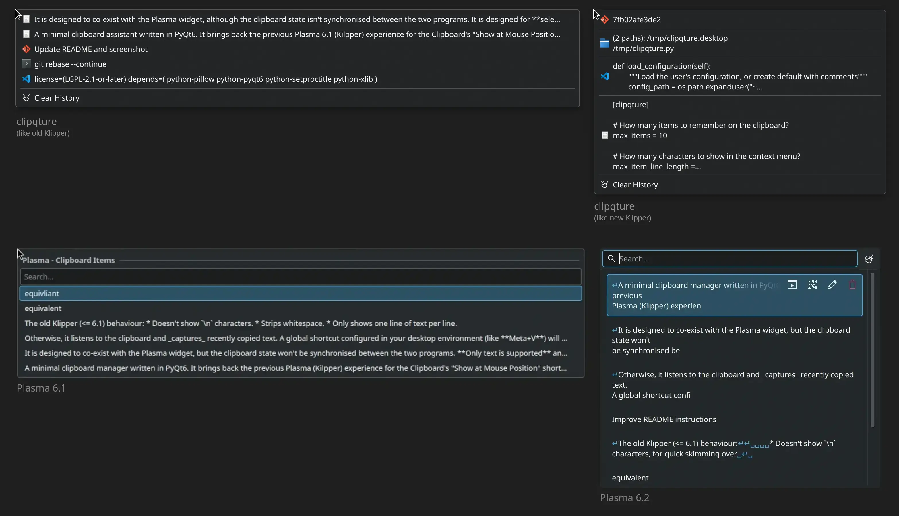

# ClipQture

Minimal context menu clipboard switcher.

ClipQture = _**Clip**board for **Qt**/KDE desktops cap**ture** program._

## What's this?

A minimal clipboard assistant written in PyQt6. It brings back the previous
Plasma (Kilpper) experience for the Clipboard's "Show at Mouse Position" shortcut.
Plasma 6.2 switched to showing the widget, as opposed to a simple context menu.

It is designed to co-exist with the Plasma widget, although the clipboard state isn't
synchronised between the two programs. **Only text is supported** and
it's **designed for X11**.

Otherwise, it listens to the clipboard and _captures_ recently copied text.
A global shortcut configured in your desktop environment (like **Meta+V**) executes
the program, which tells the first instance to open a context menu,
allowing for a quick change of the active clipboard for any text program.

## Installation

### Arch / KDE

Grab a copy from [Releases]. Or, build a package using the supplied PKGBUILD:

    git clone https://github.com/lah7/clipqture.git
    makepkg -i

[Releases]: https://github.com/lah7/clipqture

Next, use **KDE Menu Editor** to configure a shortcut key to launch this program.
This is required to open the context menu at your cursor position.

The program will be automatically started when you log in (`/etc/xdg/autostart`)

### Other Distributions & Environments

1. Make sure you have `python-pyqt6` and `python-setproctitle` installed.

2. Copy the files:

    * `clipqture.py` to `~/.local/bin/` (you may need to update your PATH)
    * `clipqture.desktop` to `~/.local/share/applications/`

    For the `.desktop` files, adjust the path of the `Exec=` line to point
    to the full path for `clipqture.py`.

Then, use your desktop environment to:

* Set up a global shortcut that executes this file.
* Add this script to run at startup.
    * For example, in KDE, use **System Settings** > **Autostart**. In MATE, this is called **Start-up Applications**.

## Configuration

There are some basic settings you can set by editing the script directly.

| Item                   | Default | Setting                                      |
| ---------------------- | ------- | -------------------------------------------- |
| `MAX_ITEMS`            | 10      | How many items to remember on the clipboard.
| `MAX_ITEM_LINE_LENGTH` | 150     | How many characters to show in the context menu.
| `OLD_KLIPPER_BEHAVIOUR`| True    | Show one line per item, strip whitespace, and hide `\n`.

## Why does it exist?

Starting in Plasma 6.2.0, KDE's Klipper (Clipboard applet) went in a different
direction. The shortcut for _"Show Clipboard Items at Mouse Position"_ now opens
the full widget at the cursor. I used it often enough that it felt like a
regression for this use case.

From a UI perspective, the widget has more buttons, more padding per item,
and buttons getting in the way. Context menus had a border, but the Plasma widget
does not (there's a shadow, but it's shallow, making it look flat).
Not to mention the widget takes up lots of vertical space that it may need
to scroll!

I was pretty happy and productive with the context menu, with one item per line,
this project brings back that simplicity. Other clipboard managers seemed too much.
Being written in Python, it's easy to modify and extend, and nobody can take
that away!

## Tip: Don't make your clipboard forget!

**It is recommended to keep Klipper enabled,** with the "show at cursor" shortcut disabled.
This makes sure that the clipboard doesn't vanish if you copy text from a program
and then close that same program.

## License

[GNU General Public License v3.0](LICENSE)
